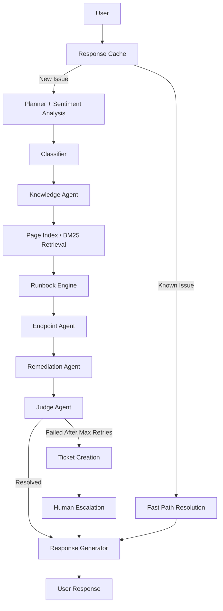

# FlowAssist AI - Multi-Agent IT Support Automation

## Overview

FlowAssist AI is an intelligent IT support automation platform that combines
Large Language Models (LLMs), retrieval systems, automated remediation,
and ticket escalation workflows to diagnose and resolve technical issues.

## Problem Statement

IT support teams spend significant time handling repetitive issues such as:
- Slow systems
- Network connectivity problems
- Software installation failures
- Device configuration issues

FlowAssist AI automates diagnosis and resolution workflows while reducing
manual intervention.

## My Contributions

- Designed multi-agent orchestration workflow
- Implemented BM25-based knowledge retrieval
- Developed FastAPI backend services
- Built remediation and escalation pipeline
- Integrated Llama 3.2 for issue analysis
- Designed root-cause analysis workflow

## System Architecture

User
↓
Response Cache
↓
Planner Agent
↓
Knowledge Agent (BM25)
↓
Runbook Engine
↓
Endpoint Agent
↓
Remediation Agent
↓
Judge Agent
↓
Ticket Escalation

## Technology Stack

| Component | Technology |
|------------|------------|
| Backend | FastAPI |
| Language | Python |
| LLM | Llama 3.2 |
| Retrieval | BM25 |
| Database | SQLite/PostgreSQL |
| APIs | REST |

## Key Features

- Automated issue classification
- Root-cause analysis
- Knowledge retrieval
- Multi-agent reasoning
- Ticket escalation
- Runbook execution

## Learning Outcomes

- Agent orchestration
- Retrieval-Augmented Generation concepts
- Backend API development
- LLM integration
- Workflow automation

## Note

This repository is a project showcase describing my contributions.
The source code belongs to the original project team and is not publicly available.
